# Home Clean App — UML System Design
## Version 1 — Initial UML Architecture

This document converts the current Home Clean App product concept into a UML-oriented system design. It is based on the current product concept and decisions reached during the design discussion.

---

# 1. System Scope

Home Clean is a cleaning-service marketplace and dispatch platform initially targeting Amman, Jordan.

The platform has three primary interfaces:

1. Customer Mobile App — Android/iOS
2. Provider App — used by cleaning companies and their teams
3. Admin Web Dashboard — used by Home Clean operations staff

All three communicate through the Home Clean Backend/API.

Core business flow:

Customer → Home Clean → Dispatch → Cleaning Company/Team → Customer

The customer relationship remains with Home Clean. Cleaning companies operate behind the platform.

---

# 2. Actors

## Primary Actors

- Customer
- Company Manager
- Team Leader / Cleaner
- Home Clean Admin
- Dispatcher / Operations Staff
- Payment Gateway
- Maps/Location Provider
- Notification Service

## Actor Relationship

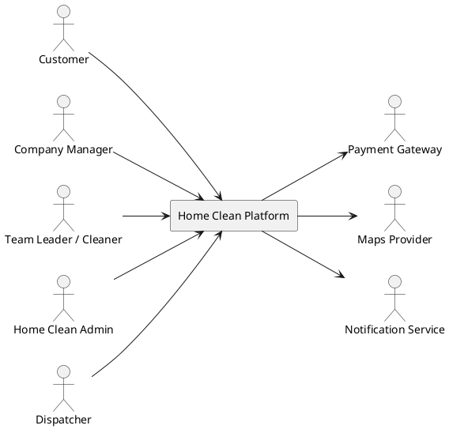

---

# 3. System Context Diagram

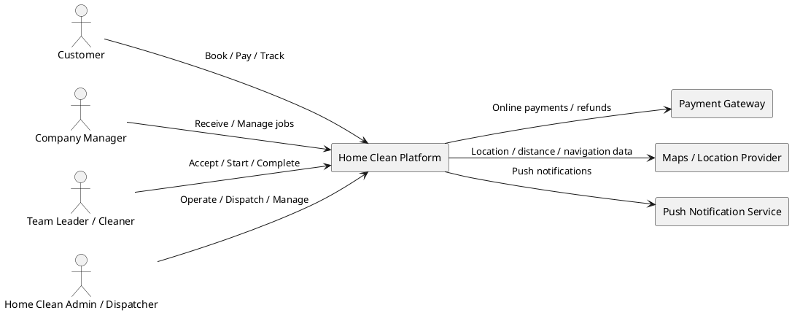

---

# 4. High-Level Component Diagram

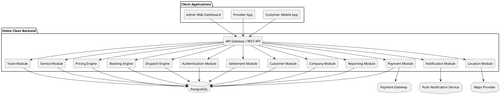

---

# 5. Deployment Diagram

Target architecture:

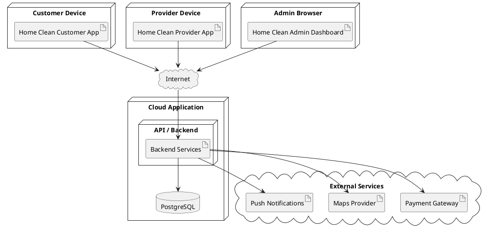

---

# 6. Customer Use Case Diagram

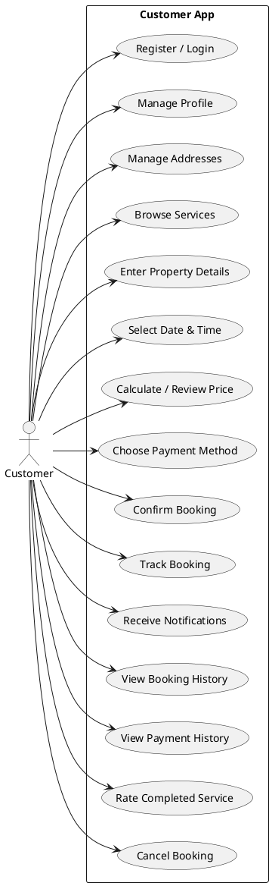

---

# 7. Provider App Use Case Diagram

The Provider App is intentionally separated from the Admin Dashboard.

A Company Manager can manage the company and its teams. A Team Leader/Cleaner sees operational jobs assigned to their team.

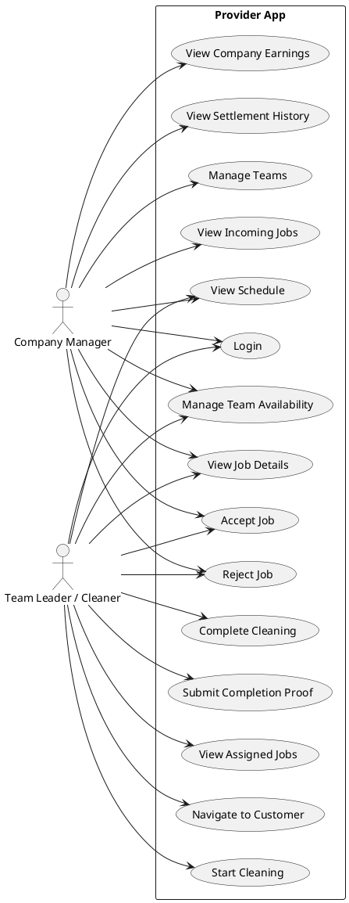

---

# 8. Admin Dashboard Use Case Diagram

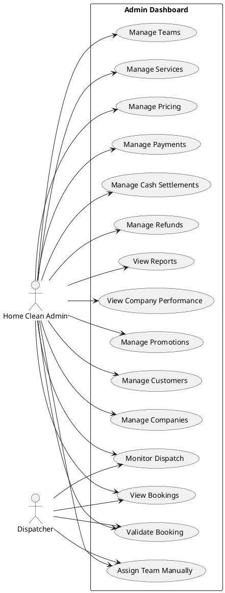

---

# 9. Core Domain Class Diagram

This is the initial domain model. It should become the basis for the database ERD later.

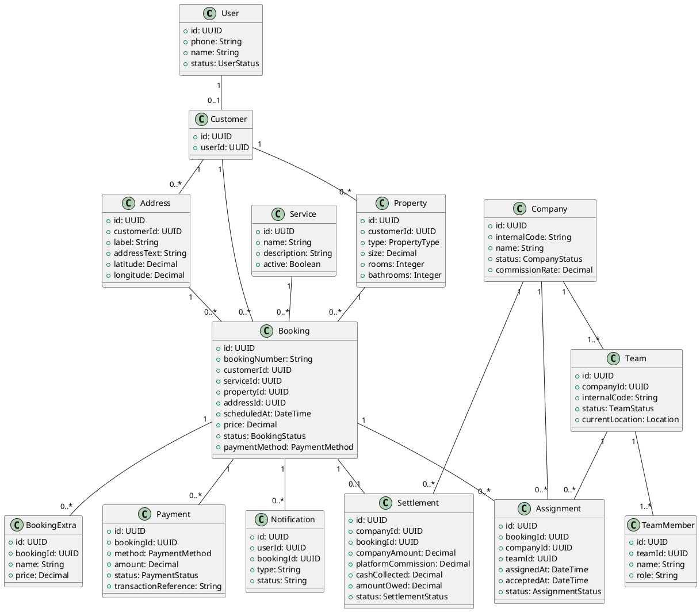

---

# 10. Booking Sequence Diagram

Normal booking flow:

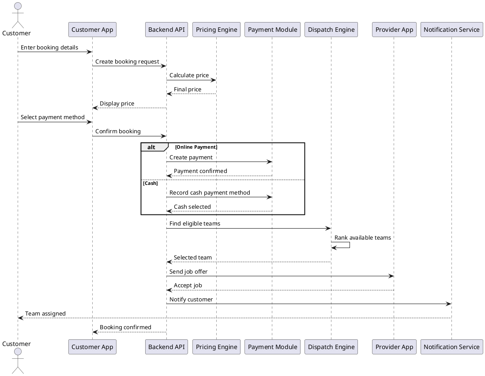

---

# 11. Provider Job Sequence Diagram

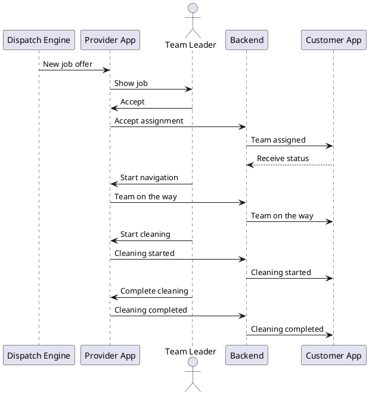

---

# 12. Booking State Machine

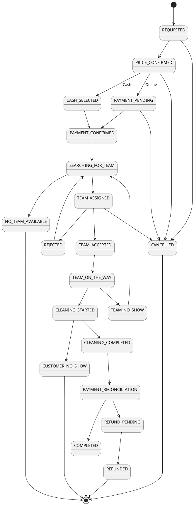

---

# 13. Automatic Dispatch Sequence

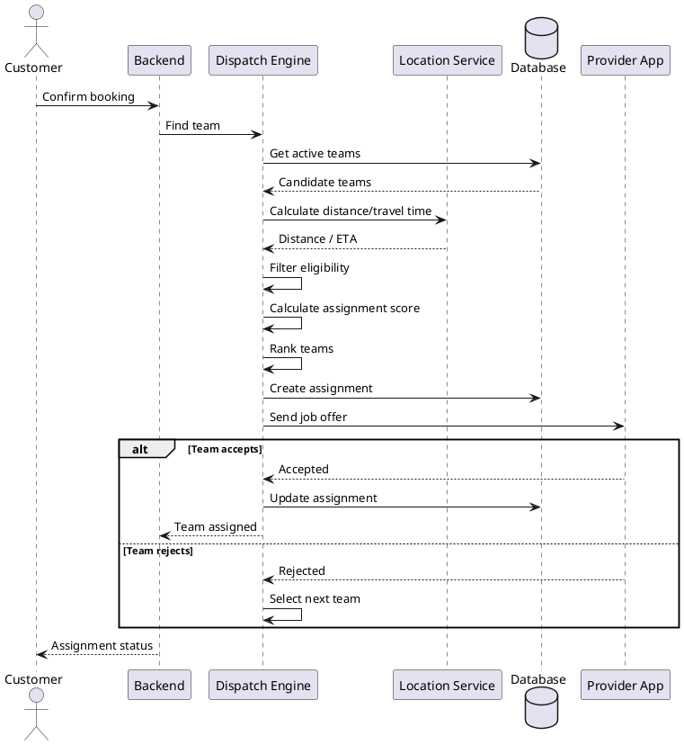

---

# 14. Payment Sequence

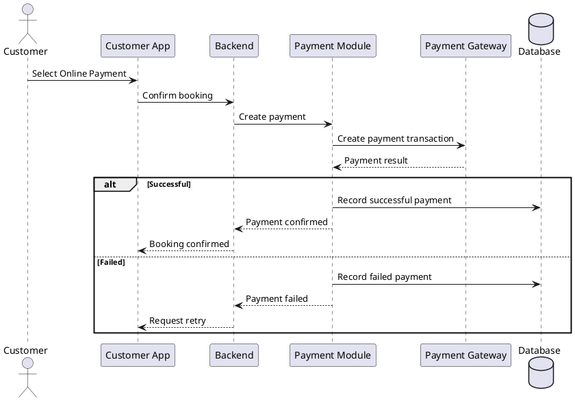

---

# 15. Cash Payment Sequence

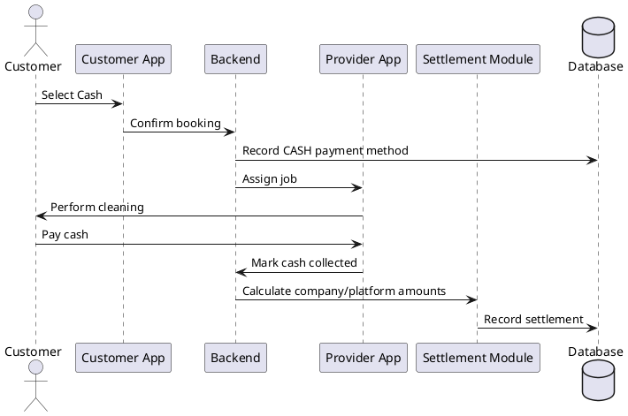

---

# 16. Settlement Class/Process Diagram

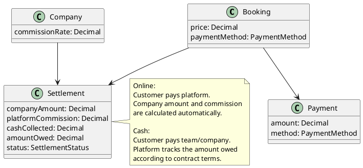

---

# 17. Company / Team Structure

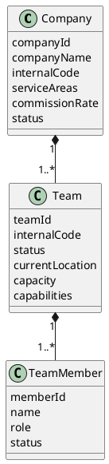

---

# 18. Customer Visibility vs Internal Data

A major architectural rule is that provider identity and internal business data are not exposed unnecessarily to customers.

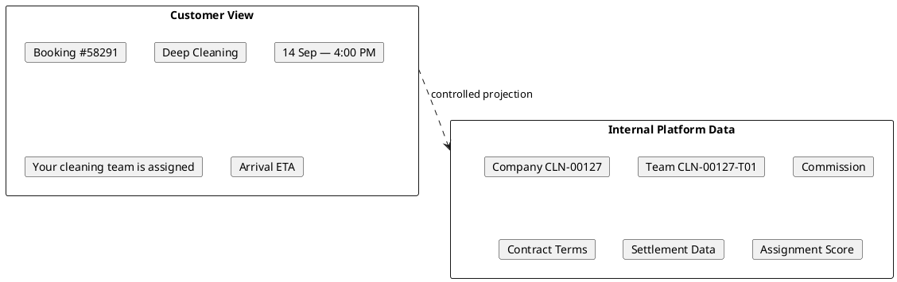

---

# 19. Main Data Relationships

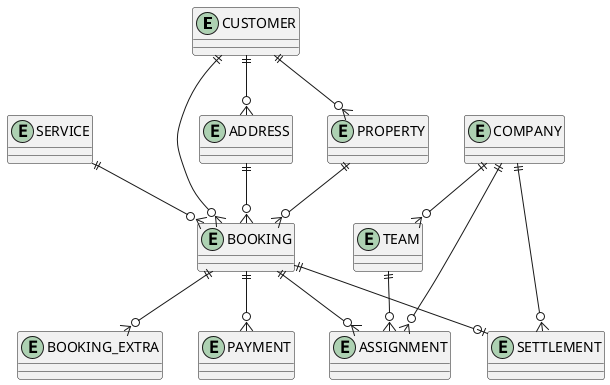

---

# 20. Recommended Interface Structure

## Customer App

```text
Home
├── Book Cleaning
├── Upcoming Booking
├── Booking History
├── Promotions
└── Profile

Booking Flow
├── Service
├── Property
├── Extras
├── Date & Time
├── Location
├── Price
└── Payment

Active Booking
├── Status
├── Team Assigned
├── ETA
└── Tracking
```

## Provider App

```text
Dashboard
├── Incoming Jobs
├── Today's Jobs
├── Active Job
└── Completed Jobs

Job
├── Details
├── Location
├── Navigation
├── Accept / Reject
├── Start
└── Complete

Company Manager
├── Teams
├── Schedule
├── Earnings
└── Settlements
```

## Admin Dashboard

```text
Dashboard
├── Operations Overview
├── Bookings
├── Customers
├── Companies
├── Teams
├── Services
├── Pricing
├── Dispatch
├── Payments
├── Settlements
├── Promotions
└── Reports
```

---

# 21. Core Architecture Decision

The Provider App should be a first-class part of the architecture.

The recommended MVP structure is:

```text
Customer App
      │
      ▼
Backend
      │
      ├──────────────► Admin Dashboard
      │
      └──────────────► Provider App
                            │
                    ┌───────┴───────┐
                    ▼               ▼
              Company Manager   Team Leader
```

A single Provider App can use role-based permissions rather than creating separate Company and Cleaner applications initially.

---

# 22. UML Diagram Inventory

The project should eventually contain these diagrams:

### Architecture
- System Context Diagram
- Component Diagram
- Deployment Diagram

### Requirements
- Customer Use Case Diagram
- Provider Use Case Diagram
- Admin Use Case Diagram

### Domain / Data
- Domain Class Diagram
- Database ER Diagram
- Company-Team Relationship Diagram
- Payment/Settlement Model

### Behavior
- Booking Sequence Diagram
- Provider Job Sequence Diagram
- Dispatch Sequence Diagram
- Online Payment Sequence Diagram
- Cash Payment Sequence Diagram
- Booking State Machine

### Future / Detailed
- Notification Sequence
- Cancellation/Refund Sequence
- Authentication/OTP Sequence
- Rating Sequence
- Recurring Booking Sequence
- Live Tracking Sequence
- Admin Manual Assignment Sequence
- Automatic Dispatch Algorithm Activity Diagram

---

# 23. Next UML Work

The next design iteration should expand this document with:

1. Detailed database ERD with every table and field
2. Complete API/component interaction diagram
3. Authentication and OTP sequence
4. Detailed pricing engine activity diagram
5. Detailed automatic dispatch activity diagram
6. Cancellation and refund state/sequence diagrams
7. Notification architecture
8. Role and permission matrix
9. Complete provider workflow
10. Complete customer booking workflow
11. Admin operational workflow
12. Full MVP-to-production architecture

This UML document should remain the living architecture reference for the Home Clean project.

---

# PHASE 2 — DATA MODEL & DATABASE UML

## 24. Phase 2 Objective

Phase 2 defines the core data model behind Home Clean.

The model covers:
- Users and customers
- Companies and teams
- Team members
- Services and service extras
- Customer properties and addresses
- Bookings
- Booking extras
- Assignments
- Payments
- Settlements
- Notifications

The database must support the booking lifecycle, provider workflow, dispatch engine, payment flow, cash reconciliation, and admin operations.

## 25. Database ERD

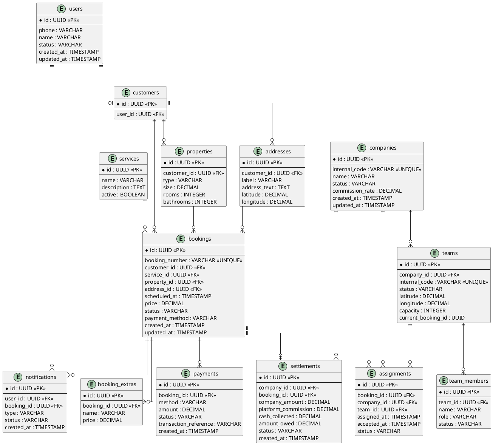

## 26. Core Relationship Rules

- User authentication identity is separated from customer business data.
- A customer can have many addresses and properties.
- A company can have many teams.
- A team can have many team members.
- A booking references one customer, service, property, and service address.
- A booking can have multiple extras.
- Assignment is separate from booking to preserve dispatch/reassignment history.
- A booking can have payment records.
- A completed booking can produce a company settlement record.
- Notifications can reference both a recipient user and a booking.

## 27. Booking-Centric Model

```text
CUSTOMER
   |
   v
BOOKING
   |---- SERVICE
   |---- PROPERTY
   |---- ADDRESS
   |---- BOOKING_EXTRAS
   |
   +---- ASSIGNMENTS ---- COMPANY ---- TEAM ---- TEAM_MEMBER
   |
   +---- PAYMENTS
   |
   +---- SETTLEMENT
```

## 28. Assignment History

Assignments should be historical records rather than a single field on Booking. This supports rejection and reassignment:

```text
Booking #58291
  |
  +-- Assignment 1: Team A -> REJECTED
  +-- Assignment 2: Team B -> REJECTED
  +-- Assignment 3: Team C -> ACCEPTED
```

## 29. Financial Separation

```text
BOOKING
  |
  +-- PAYMENT       = money collected / payment transaction
  |
  +-- SETTLEMENT    = company amount, platform commission,
                      cash reconciliation and amount owed
```

## 30. Provider Data Isolation

Provider access must be scoped by role and ownership:

- Team Leader/Cleaner: assigned team/jobs only.
- Company Manager: company jobs, teams, schedules and financial views permitted to the company.
- Dispatcher: operational booking and dispatch information.
- Home Clean Admin: platform-wide operational and financial administration.

The backend authorization layer must enforce these boundaries rather than relying on the mobile/web UI.

## 31. Recommended Database Constraints

Initial constraints to finalize during implementation:

- Unique company internal code.
- Unique team internal code.
- Unique booking number.
- Foreign keys on all relationships.
- Non-negative monetary values.
- Valid booking, assignment, payment and settlement statuses.
- A team cannot have conflicting active assignments.
- A booking cannot have more than one active assignment at the same time.
- Provider users cannot query records outside their permitted company/team scope.
- Customer addresses used by a booking must belong to that customer.

## 32. Phase 2 Design Decisions

1. Booking is the central operational entity.
2. Assignment is separate from Booking to preserve dispatch history.
3. Company and Team are separate entities.
4. Customer Address and Property are separate entities.
5. Payment and Settlement are separate financial concepts.
6. Provider access is role- and scope-based.

## 33. Next Data-Model Work

Before database implementation, expand the ERD into a production schema covering:

1. Exact columns and data types
2. Primary and foreign keys
3. Indexes
4. Status/enumeration definitions
5. Audit fields
6. Soft deletion strategy
7. Assignment history
8. Payment transaction history
9. Settlement batches
10. User/provider role mapping
11. Service-area mapping
12. Team availability records
13. Pricing rules
14. Booking price snapshots

---

# PHASE 3 — BOOKING BEHAVIOR & STATE MANAGEMENT

## 34. Objective

Phase 3 defines how a booking behaves from creation through completion or exception. The booking lifecycle is the operational backbone of Home Clean.

## 35. Booking State Machine

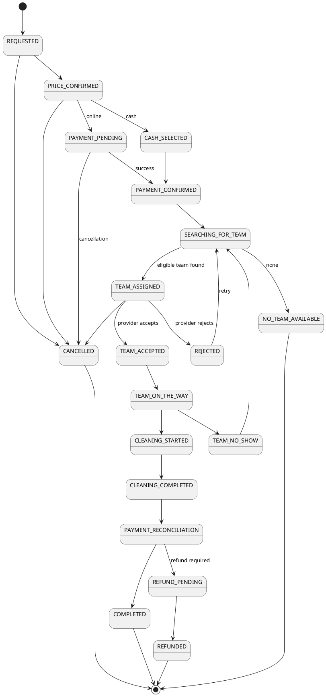

## 36. Customer Booking Activity

```plantuml
@startuml
start
:Open App;
:Select Service;
:Enter Property Details;
:Select Address;
:Select Date & Time;
:Calculate Price;
:Review Booking;
if (Confirm?) then (Yes)
  :Select Payment Method;
  if (Online?) then (Yes)
    :Process Payment;
    if (Success?) then (Yes)
      :Payment Confirmed;
    else (No)
      :Show Payment Failure;
      stop
    endif
  else (Cash)
    :Record Cash Method;
  endif
  :Create Booking;
  :Search Eligible Teams;
  if (Team Available?) then (Yes)
    :Assign Team;
    :Notify Provider;
  else (No)
    :Set NO_TEAM_AVAILABLE;
  endif
else (No)
  :Exit / Cancel;
endif
stop
@enduml
```

## 37. Provider Job Activity

```plantuml
@startuml
start
:Receive Job Offer;
if (Accept?) then (Yes)
  :Accept Assignment;
  :View Job Details;
  :View Location;
  :Navigate;
  :Mark Team On The Way;
  :Arrive;
  :Start Cleaning;
  :Perform Cleaning;
  :Complete Cleaning;
  :Submit Completion Proof if required;
  :Send Completion to Backend;
else (No)
  :Reject Assignment;
  :Trigger Reassignment;
endif
stop
@enduml
```

## 38. Complete Booking Sequence

```plantuml
@startuml
actor Customer
participant "Customer App" as App
participant "Backend API" as API
participant "Pricing Engine" as Pricing
participant "Payment Module" as Payment
participant "Dispatch Engine" as Dispatch
participant "Provider App" as Provider
participant "Notification Service" as Notify
Customer -> App: Enter booking details
App -> API: Request price
API -> Pricing: Calculate price
Pricing --> API: Price
API --> App: Display price
Customer -> App: Confirm booking
App -> API: Create booking
alt Online
 API -> Payment: Process payment
 Payment --> API: Payment result
else Cash
 API -> Payment: Record cash method
end
API -> Dispatch: Find eligible team
Dispatch -> Dispatch: Filter and rank candidates
Dispatch --> API: Selected team
API -> Provider: Job offer
Provider -> API: Accept
API -> Notify: Team assigned
Notify --> Customer: Team assigned
Provider -> API: Team on the way
API -> Notify: Status update
Notify --> Customer: Team on the way
Provider -> API: Cleaning started
API -> Notify: Status update
Notify --> Customer: Cleaning started
Provider -> API: Cleaning completed
API -> Notify: Completion notification
Notify --> Customer: Cleaning completed
API -> Payment: Reconcile
API -> API: Calculate settlement
API --> App: Booking completed
@enduml
```

## 39. Rejection / Reassignment

A provider rejection should normally reject the **assignment attempt**, not the customer's booking. The dispatch engine can select another eligible team.

```plantuml
@startuml
participant "Dispatch Engine" as D
participant "Provider App" as P
participant "Backend" as B
D -> P: Offer booking
alt Accept
 P -> B: Accept assignment
 B -> D: Confirm
else Reject
 P -> B: Reject assignment
 B -> D: Request next candidate
 D -> D: Rank remaining teams
 D -> P: Offer next team
end
@enduml
```

## 40. Cancellation / Refund

```plantuml
@startuml
actor Customer
participant "Customer App" as App
participant "Backend" as API
participant "Payment Module" as Pay
participant "Provider App" as Provider
Customer -> App: Cancel booking
App -> API: Cancellation request
API -> API: Validate cancellation policy
alt Allowed
 API -> API: Mark CANCELLED
 API -> Provider: Cancel assignment if needed
 alt Refund required
  API -> Pay: Create refund
  Pay --> API: Refund result
  API -> API: REFUNDED or REFUND_PENDING
 end
 API --> App: Cancellation confirmed
else Not allowed
 API --> App: Cancellation rejected
end
@enduml
```

## 41. Booking Status Ownership

| Status | Primary owner |
|---|---|
| REQUESTED | Backend |
| PRICE_CONFIRMED | Backend |
| PAYMENT_PENDING | Payment Module |
| CASH_SELECTED | Backend |
| PAYMENT_CONFIRMED | Payment Module / Backend |
| SEARCHING_FOR_TEAM | Dispatch Engine |
| TEAM_ASSIGNED | Dispatch Engine |
| TEAM_ACCEPTED | Provider App / Backend |
| TEAM_ON_THE_WAY | Provider App / Backend |
| CLEANING_STARTED | Provider App / Backend |
| CLEANING_COMPLETED | Provider App / Backend |
| PAYMENT_RECONCILIATION | Backend |
| COMPLETED | Backend |
| CANCELLED | Customer/Admin/Backend according to policy |
| REJECTED | Provider App / Backend |
| NO_TEAM_AVAILABLE | Dispatch Engine |
| TEAM_NO_SHOW | Provider/Admin |
| REFUND_PENDING | Payment Module |
| REFUNDED | Payment Module |

## 42. Booking Status History

Recommended audit entity:

```text
booking_status_history
- id
- booking_id
- previous_status
- new_status
- changed_by_user_id
- changed_by_role
- reason
- metadata
- created_at
```

Every important status transition should be auditable.

## 43. Phase 3 Design Decisions

1. Backend owns the booking state machine.
2. Apps request actions; they do not arbitrarily set statuses.
3. Provider accept/reject/start/complete actions are explicit operational events.
4. Assignment rejection can trigger reassignment.
5. Financial reconciliation is part of booking closure.
6. Status history should be retained for support, disputes and reporting.

## 44. Next Phase

Phase 4 will define dispatch in detail: team availability, service-area eligibility, capabilities, distance/ETA, assignment scoring, timeouts, rejection handling, reassignment, manual admin dispatch, workload/capacity, and dispatch monitoring.


# PHASE 4 — DISPATCH & AUTOMATIC TEAM ASSIGNMENT

## 45. Dispatch Goals

The dispatch engine selects an eligible cleaning team for a booking using availability, service area, service type/capability, workload/capacity, distance/ETA, reliability and operational constraints. Customer-facing company identity remains hidden.

## 46. Dispatch Eligibility Pipeline

```text
Booking ready for dispatch
  -> validate address/service/date-time
  -> find teams available for requested slot
  -> filter by service area
  -> filter by required service/capabilities
  -> filter by capacity/workload
  -> calculate distance + ETA
  -> score candidates
  -> offer to best candidate
  -> accept => TEAM_ASSIGNED / TEAM_ACCEPTED
  -> reject/timeout => next candidate
  -> none => NO_TEAM_AVAILABLE / admin intervention
```

## 47. Team Availability Model

Recommended operational fields:
- team status: AVAILABLE, BUSY, OFFLINE, PAUSED
- working schedule
- service area
- capacity
- current assignment count
- current location/last known location
- supported services
- active/inactive flag
- reliability/performance indicators

## 48. Service-Area Eligibility

A team is eligible only when its configured service area covers the booking location. Area rules can later support governorate/city/neighborhood polygons or radius rules.

## 49. Team Capability Matching

The dispatch engine checks service type and required skills/equipment before an offer is created.

## 50. Candidate Scoring

Suggested conceptual score:

```text
score =
  availability_score
+ service_match_score
+ capability_score
+ proximity_score
+ workload_score
+ reliability_score
+ performance_score
```

Weights are configurable by Home Clean operations. Exact production weights should be validated with real operational data rather than hard-coded permanently.

## 51. Assignment Offer

An assignment is an offer to a provider team. It should contain booking ID, service summary, scheduled time, location, estimated duration, customer instructions allowed by policy, and an expiration time.

Provider response:
- ACCEPT
- REJECT(reason)
- TIMEOUT

## 52. Reassignment Rules

If a team rejects or times out:
1. record assignment attempt;
2. exclude the failed team for the current attempt unless admin overrides;
3. select the next eligible candidate;
4. repeat until a configured retry limit;
5. if exhausted, mark NO_TEAM_AVAILABLE and alert operations.

## 53. Manual Dispatch

Admin can manually assign or reassign a booking. Manual actions must be authorized and audited with actor, reason and timestamp.

## 54. Dispatch Monitoring

Admin dashboard should expose:
- unassigned bookings
- pending offers
- assignment age
- rejected/expired offers
- team workload
- service-area gaps
- active jobs
- dispatch failures

## 55. Dispatch Activity Diagram

```plantuml
@startuml
start
:Booking ready for dispatch;
:Find available teams;
:Filter service area;
:Filter service/capability;
:Filter workload/capacity;
:Calculate distance/ETA;
:Score candidates;
if (Candidate exists?) then (yes)
  :Send assignment offer;
  if (Accepted?) then (yes)
    :Create active assignment;
    :Notify customer;
  else (no/timeout)
    :Record rejection/timeout;
    if (Retry allowed?) then (yes)
      :Select next candidate;
    else (no)
      :NO_TEAM_AVAILABLE;
      :Alert admin;
    endif
  endif
else (no)
  :NO_TEAM_AVAILABLE;
  :Alert admin;
endif
stop
@enduml
```

## 56. Dispatch Sequence Diagram

```plantuml
@startuml
actor Customer
participant "Home Clean Backend" as API
participant "Dispatch Engine" as D
participant "Provider App" as P
actor Admin

Customer -> API: Create/confirm booking
API -> D: Dispatch booking
D -> D: Build eligible candidate set
D -> D: Score candidates
D -> P: Assignment offer
alt Accept
 P -> D: ACCEPT
 D -> API: Assignment confirmed
 API -> Customer: Team assigned
else Reject/Timeout
 P -> D: REJECT / timeout
 D -> D: Record attempt
 D -> D: Select next candidate
 D -> P: Next assignment offer
else No candidates
 D -> API: NO_TEAM_AVAILABLE
 API -> Admin: Dispatch alert
end
@enduml
```

# PHASE 5 — PRICING, PAYMENTS, CASH & SETTLEMENTS

## 57. Pricing Model

The price shown to the customer should be calculated by Home Clean from service base price plus applicable property/size/duration/extras/rules, before payment selection.

Conceptual formula:

```text
customer_total = base_service_price + extras + applicable_adjustments + fees - discounts
```

Provider payout and Home Clean commission are separate financial concepts.

## 58. Payment Methods

MVP supports:
- online payment
- cash payment

Payment records should include method, amount, status, provider/reference where applicable, timestamps and failure/refund information.

## 59. Online Payment Sequence

```text
Booking -> PRICE CONFIRMED -> PAYMENT PENDING
       -> payment gateway
       -> success webhook/callback
       -> PAYMENT CONFIRMED
       -> dispatch
```

Payment success must be verified server-side. Client success screens are not sufficient evidence of payment.

## 60. Cash Payment Sequence

```text
Booking -> CASH SELECTED -> dispatch
       -> service completed
       -> cash collected/confirmed
       -> reconciliation
       -> COMPLETED
```

## 61. Refund Flow

```text
Refund requested
 -> validate refundable amount
 -> REFUND_PENDING
 -> payment provider refund (online) or cash adjustment policy
 -> REFUNDED / failed-refund exception
```

## 62. Settlement Model

Recommended separation:
- customer payment transaction
- platform revenue/commission
- provider payable
- provider settlement batch
- settlement payment record

A provider should not receive access to another company's financial data.

## 63. Financial State Diagram

```plantuml
@startuml
[*] --> PAYMENT_PENDING
PAYMENT_PENDING --> PAYMENT_CONFIRMED : online success
PAYMENT_PENDING --> CASH_SELECTED : cash chosen
PAYMENT_PENDING --> PAYMENT_FAILED : online failure
PAYMENT_CONFIRMED --> REFUND_PENDING : refundable cancellation
REFUND_PENDING --> REFUNDED : refund confirmed
REFUND_PENDING --> REFUND_FAILED : refund failed
CASH_SELECTED --> CASH_COLLECTED : cash received
PAYMENT_CONFIRMED --> RECONCILED : settlement calculated
CASH_COLLECTED --> RECONCILED : settlement calculated
RECONCILED --> COMPLETED
PAYMENT_FAILED --> PAYMENT_PENDING : retry
@enduml
```

# PHASE 6 — NOTIFICATIONS, MAPS & REAL-TIME OPERATIONS

## 64. Notification Events

Customer notifications:
- booking created
- payment confirmed/failed
- team assigned
- team accepted
- team on the way
- cleaning started
- cleaning completed
- cancellation/refund

Provider notifications:
- new assignment offer
- offer expiring
- booking changes/cancellation
- navigation/job reminders

Admin notifications:
- no team available
- repeated rejection
- payment failure
- team no-show/customer no-show
- operational exceptions

## 65. Notification Architecture

```text
Backend Event
 -> Notification Service
 -> preference/permission check
 -> FCM/APNs/push channel
 -> recipient device
 -> delivery/logging
```

The backend event remains the source of truth; push delivery is a notification mechanism, not a business-state mechanism.

## 66. Maps & Location

Use a map provider for address selection, geocoding, routing and ETA where required. Store the canonical booking location/address snapshot so a later address-profile edit does not silently rewrite historical bookings.

## 67. Real-Time Tracking

For MVP, tracking can be status-based. Later, provider location updates may support customer map tracking. Location sharing should be limited to what is operationally necessary.

## 68. Notification Sequence

```plantuml
@startuml
participant Backend
participant NotificationService
participant PushProvider
participant Customer
participant Provider

Backend -> NotificationService: Booking event
NotificationService -> PushProvider: Send customer notification
PushProvider -> Customer: Push
NotificationService -> PushProvider: Send provider notification
PushProvider -> Provider: Push
NotificationService -> Backend: Delivery/log result
@enduml
```

# PHASE 7 — AUTHENTICATION, AUTHORIZATION & SECURITY

## 69. Identity Model

Roles:
- CUSTOMER
- COMPANY_MANAGER
- TEAM_LEADER / CLEANER
- HOME_CLEAN_ADMIN
- DISPATCHER

Authentication can use phone + OTP as proposed in the initial specification. Session/token handling must be server-controlled.

## 70. Authorization Model

Authorization is role + resource based.

```text
Customer -> own profile, own properties, own bookings, own payments
Company Manager -> own company, own teams, own assigned/eligible jobs, own settlements
Team Leader/Cleaner -> own team jobs and operational actions
Dispatcher -> dispatch operations without unrestricted financial/admin access
Home Clean Admin -> platform-wide operations according to role
```

## 71. Provider Data Isolation

A provider request must be scoped by authenticated company/team identity on the backend. Never rely on hidden UI fields or client-supplied company IDs for isolation.

## 72. Security Controls

- server-side authorization on every protected endpoint
- input validation
- rate limiting for OTP/auth endpoints
- secure token/session expiry and revocation
- encrypted transport
- secrets outside source code
- audit logs for privileged actions
- least-privilege admin roles
- payment webhook signature/verification
- privacy-aware logging

## 73. Authorization Sequence

```plantuml
@startuml
actor User
participant App
participant API
participant Auth
participant Policy
participant DB
User -> App: Request protected action
App -> API: Access token + request
API -> Auth: Validate token
Auth --> API: Identity + roles
API -> Policy: Authorize identity/resource/action
alt Allowed
 Policy --> API: Allow
 API -> DB: Read/write scoped data
 API --> App: Result
else Denied
 Policy --> API: Deny
 API --> App: 403/authorization error
end
@enduml
```

# PHASE 8 — API & INTEGRATION ARCHITECTURE

## 74. API Domains

Suggested REST domains:
- `/auth`
- `/customers`
- `/addresses`
- `/services`
- `/bookings`
- `/assignments`
- `/payments`
- `/providers`
- `/teams`
- `/notifications`
- `/admin`

Exact endpoint names remain implementation choices.

## 75. Core API Pattern

```text
Mobile/Web Client
 -> HTTPS API
 -> authentication middleware
 -> authorization/policy
 -> domain service
 -> transaction/repository
 -> PostgreSQL
 -> event/notification side effects
```

## 76. Booking API Lifecycle

```text
POST booking draft/create
GET pricing/quote
POST booking confirmation
POST payment initiation (online)
POST cash selection
GET booking
POST booking cancellation
GET booking status/history
```

Provider operations:

```text
GET assignment offers
POST assignment accept/reject
POST job on-the-way
POST job start
POST job complete
POST proof upload (if enabled)
```

Admin operations:

```text
GET/search bookings
POST manual assignment
POST reassignment
POST company/team management
GET dispatch monitoring
GET settlements/reports
```

## 77. Webhooks

External providers should call dedicated webhook endpoints. Webhooks must be idempotent and independently verified.

## 78. API Sequence — Booking to Dispatch

```plantuml
@startuml
actor Customer
participant "Customer App" as C
participant API
participant BookingService as B
participant PaymentService as Pay
participant DispatchEngine as D
participant ProviderApp as P

Customer -> C: Confirm booking
C -> API: POST /bookings
API -> B: Create booking
B --> API: Price + booking
API --> C: Booking created
alt Online
 C -> API: Initiate payment
 API -> Pay: Create payment
 Pay --> C: Payment action
 Pay -> API: Verified webhook
 API -> B: Payment confirmed
else Cash
 C -> API: Select cash
 API -> B: Cash selected
end
API -> D: Dispatch
D -> P: Assignment offer
P -> D: Accept
D -> API: Assignment confirmed
API -> C: Team assigned
@enduml
```

# PHASE 9 — ADMIN, PROVIDER & CUSTOMER INTERFACE ARCHITECTURE

## 79. Customer App Screens

```text
Splash / Auth
Home
Services
Service Details
Property / Address
Date & Time
Price Review
Payment Method
Booking Confirmation
Booking Tracking
Booking History
Booking Details
Rating / Review
Profile
Notifications
Support / Help
```

## 80. Provider App Screens

Company Manager:
```text
Dashboard
Incoming Jobs
All Jobs
Job Details
Teams
Team Schedule
Team Performance
Earnings
Settlements
Company Profile
Notifications
```

Team Leader/Cleaner:
```text
My Jobs
Job Details
Customer Location / Navigation
Accept / Reject
On The Way
Start Cleaning
Complete Cleaning
Proof / Notes
Job History
```

## 81. Admin Dashboard Screens

```text
Overview
Live Dispatch
Bookings
Calendar / Schedule
Customers
Companies
Teams
Services
Pricing
Payments
Cash Collection
Settlements
Refunds
Notifications
Reports
Audit Logs
Settings
```

## 82. UI-to-Backend Boundary

UI actions should map to explicit domain commands. Example:

```text
Provider taps Accept
 -> POST accept-assignment command
 -> backend validates assignment + expiry + team status
 -> backend changes assignment/booking state
 -> backend records history
 -> backend emits notification
```

# PHASE 10 — TESTING, DEPLOYMENT, OBSERVABILITY & SCALING

## 83. Testing Pyramid

Unit tests:
- pricing rules
- dispatch scoring
- state transitions
- authorization policies
- settlement calculations

Integration tests:
- booking + DB
- payment webhook + idempotency
- dispatch + provider acceptance
- notification event flow

End-to-end tests:
- customer booking
- online payment
- cash booking
- provider acceptance/rejection
- reassignment
- completion
- refund/cancellation

## 84. State-Machine Test Matrix

Every transition must test:
- valid actor
- valid previous state
- required data
- invalid actor
- invalid previous state
- duplicate request/idempotency
- audit record creation
- notification side effect where applicable

## 85. Deployment Architecture

```text
Flutter Customer App      Flutter Provider App
          \                    /
           \                  /
             HTTPS API / Load Balancer
                       |
                Node.js/NestJS Backend
          _________|___________
         |         |           |
     PostgreSQL  Redis     Job/Worker Queue
         |         |           |
         |      cache      notifications
         |
  Object Storage (proof/media)
         |
 External services: Maps / Push / Payment

React/Next.js Admin Dashboard -> HTTPS API
```

## 86. Observability

Track:
- API latency/error rates
- booking conversion
- payment success/failure
- dispatch success rate
- average assignment time
- rejection/timeout rate
- no-team-available rate
- provider completion rate
- notification failures
- cash reconciliation differences

## 87. Auditability

Audit high-impact actions:
- price changes
- manual assignment/reassignment
- cancellation/refund
- payment state changes
- settlement changes
- company/team activation
- role/permission changes

## 88. Backup & Recovery

Production should include:
- automated PostgreSQL backups
- tested restore procedure
- retention policy
- monitoring/alerting
- disaster-recovery documentation

## 89. Scaling Strategy

Start as a modular backend rather than prematurely splitting into microservices. Separate modules/services by domain boundaries first. Scale stateless API instances horizontally, move asynchronous workloads to workers/queues, and introduce caching/read optimization as traffic requires.

## 90. Production Readiness Checklist

- [ ] Customer app
- [ ] Provider app
- [ ] Admin dashboard
- [ ] Auth + RBAC
- [ ] Booking state machine
- [ ] Database constraints
- [ ] Dispatch engine
- [ ] Pricing engine
- [ ] Online payment
- [ ] Cash workflow
- [ ] Settlement workflow
- [ ] Notifications
- [ ] Maps/address handling
- [ ] Audit logs
- [ ] Automated tests
- [ ] Backups
- [ ] Monitoring
- [ ] CI/CD
- [ ] App-store deployment
- [ ] Operational support process

# FINAL UML INVENTORY — COMPLETE

| Phase | Scope | Main diagrams/artifacts |
|---|---|---|
| 1 | System & Roles | Context, components, deployment, use cases, class, sequences |
| 2 | Database | ERD, domain relationships, constraints |
| 3 | Booking Behavior | State machine, activities, sequences, exceptions |
| 4 | Dispatch | Eligibility, scoring, assignment, rejection, reassignment |
| 5 | Finance | Pricing, online payment, cash, refund, settlement |
| 6 | Operations | Notifications, maps, real-time events |
| 7 | Security | Auth, RBAC, isolation, authorization |
| 8 | API | API domains, lifecycle, webhooks, integrations |
| 9 | Interfaces | Customer, Provider, Admin screen architecture |
| 10 | Production | Testing, deployment, observability, backups, scaling |

# FINAL ARCHITECTURAL RULES

1. Backend owns business state and financial truth.
2. Customers book with Home Clean, not directly with underlying companies.
3. Provider companies/teams operate through the Provider App and are isolated by company/team scope.
4. Customer-facing company identity may remain hidden as specified.
5. Dispatch is a backend responsibility with auditable assignment attempts.
6. Online payment confirmation must be server-verified.
7. Cash must have an explicit collection/reconciliation workflow.
8. Manual admin overrides are allowed but audited.
9. Apps request domain actions; they do not directly mutate arbitrary statuses.
10. Historical booking, address, payment and settlement data should remain auditable.
11. MVP may operate provider fulfillment through admin first, but the Provider App is the intended operational interface.
12. Exact pricing weights, dispatch weights, cancellation windows and settlement cadence should be configurable and validated operationally before production lock-in.
